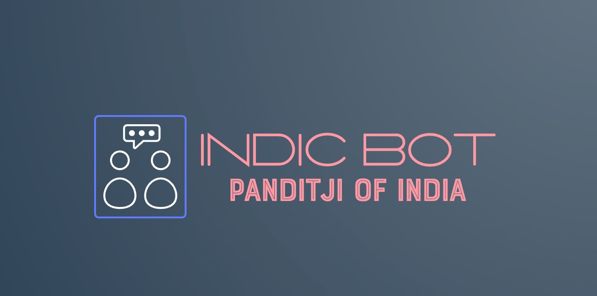

# Building the optimized Indic Language bot by using the Python-based Sarvam AI LLMs



## About this package

This new solution will to evaluate and enhance Sarvam AI Sandbox API, which is created from scratch specially for the Indic Languages by using Sarvam AI & Python. This opens a brand new opportunities for Indian IT companies & business start-ups, which has less bias & better performance in comparison with GPT-4o. I've added a tiny part of optimized wrapper layer to improve the performance of the Sandbox AI's API for better performance. This project is for the advanced Python, Sarvam AI for data Science Newbie & AI evangelist.


## How to use this package

(The following instructions apply to Posix/bash. Windows users should check
[here](https://docs.python.org/3/library/venv.html).)

First, clone this repository and open a terminal inside the root folder.


Install the requirements:

```bash
pip install -r requirements.txt
```

Install the above requirements.

Create and activate a new virtual environment (recommended) for consumer application by running
the following:

```bash
python3 -m venv senv
source senv/bin/activate
```

Run the server, which will interact with Open AI & UpTrain server by invoking the specific APIs.

```bash
python playRealTimeSarvamAIBot.py
```

Please find the some of the important dependent package -

```

pip install SpeechRecognition==3.10.4
pip install pydub==0.25.1
pip install sounddevice==0.5.0
pip install numpy==1.26.4
pip install soundfile==0.12.1


```

## Screenshots


## Resources

- To view the complete demo with sound, check out our [YouTube Page](https://youtu.be/7VQSncDoeeU).
- To view on Python, check out the [Python Page](https://docs.python.org/3/).
- To view more on the Sarvam AI, check out this [Sarvam AI Official Page](https://docs.sarvam.ai/api-reference-docs/introduction).
- To view Sarvam AI, Hugging Face Model, check out this [Sarvam AI Open-Source Page](https://huggingface.co/sarvamai/sarvam-2b-v0.5).
- To view the dmeo on YouTube, check out this [Sarvam AI Open-Source Page](https://youtu.be/tbyJBSXyIv8).
